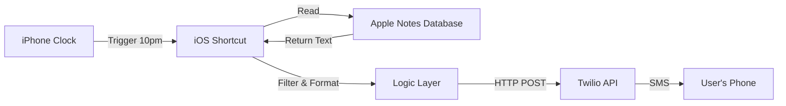

# Option A: iPhone Shortcuts Implementation

## 1. Core Problem & Solution
**The Problem:** Daily tasks are often forgotten or pushed to the weekend because manually checking the Apple Notes app at night adds friction.
**The Solution:** A "push" notification system that actively sends unfinished tasks to the user via SMS at 10:00 PM, utilizing the device they already have (iPhone) without requiring a server.

---

## 2. Architecture (Option A)

We chose **Option A** (Client-Side Automation) to avoid setting up external servers or cloud functions.

### Key Components
- **Source:** Apple Notes (Note title: "Daily Tasks")
- **Engine:** iOS Shortcuts App
- **Delivery:** Twilio Programmable Messaging API
- **Network:** WiFi/Cellular on iPhone

---

## 3. Implementation Journey

### Phase 1: The Foundation (Twilio Connection)
We started by establishing the connection to the outside world.
- **Action:** `Get Contents of URL`
- **Method:** `POST`
- **Endpoint:** `https://api.twilio.com/2010-04-01/Accounts/{SID}/Messages.json`
- **Validation:** Successfully sent a manual test SMS ("Test from Daily Tasks Reminder").

### Phase 2: Notes Integration
We connected the automation to the local data source.
- **Action:** `Find Notes`
- **Filter:** `Name is "Daily Tasks"`
- **Validation:** Successfully extracted the raw text of the note and sent it via SMS.

### Phase 3: Logic & Formatting (Completed)
We refined the logic to parse the note content accurately.
- **Logic:** `Split Text` by new lines → `Repeat with Each` → `If` statement to keep only unchecked items.
- **Filtering Strategy:** Instead of excluding completed items (which proved unreliable due to varying characters), we switched to **including** lines containing `[ ]`.
- **Formatting:** Combined valid lines into a bulleted list with a header.
- **Validation:** Verified that mixed lists (checked/unchecked) result in an SMS containing *only* the unfinished tasks.

### Phase 4: Automation (Completed)
We configured the system to run autonomously.
- **Trigger:** Time of Day (10:00 PM Daily)
- **Mode:** "Run Immediately" (Background execution)
- **Notification:** Silenced (No "Notify When Run")
- **Validation:** Validated that the system triggers while the iPhone is locked and idle, delivering the SMS without user intervention.

---

## 4. Troubleshooting Log: Problems & Solutions

### Problem 1: Authentication Field Visibility
**Issue:** When configuring the HTTP request headers for Twilio, the "Authorization" header field was difficult to locate in the iOS 26.2 Shortcuts interface.
**Solution:**
1. Identified that iOS Shortcuts often hides headers under "Show More".
2. Used the built-in "Authentication: Basic" option as a simpler alternative to manually encoding Base64 headers.

### Problem 2: Filtering Completed Items
**Issue:** The Shortcut was sending duplicates and failing to exclude completed items.
**Root Cause:** Apple Notes exports checkboxes with varying characters depending on the OS version and state (e.g., `[x]`, `☑`, or `X`). Trying to exclude specific "checked" characters was brittle.
**Solution:**
1. **Inverted Logic:** Instead of filtering *out* checked items, we filtered *in* unchecked items.
2. **Condition:** `If Repeat Item contains "[ ]"` (Empty bracket).
3. **Variable Management:** Ensured the `UnfinishedTasks` variable was cleared at the start of the script to prevent appending to old data.

---

## 5. Visual Documentation

The following screenshots capture the Shortcut workflow and Twilio configuration:

### Workflow Logic (iOS Shortcuts)
These images depict the step-by-step logic built inside the Shortcuts app:
1.  
2.  
3.  
4.  

### Infrastructure (Twilio Console)
Configuration of the sender number:
- **Active Number:** `[YOUR_TWILIO_NUMBER]`
- **Capabilities:** Voice, SMS, MMS
- **Region:** CA (Canada)

---

## 6. Conclusion
The project has successfully met all MVP requirements.
1.  **Parsing Fixed:** We successfully implemented logic to strictly identify unchecked items using the `[ ]` pattern.
2.  **Polished:** The system handles empty lists and formats the output cleanly.
3.  **Automated:** The 10pm background trigger is active and verified.

The system is now live and providing nightly value.
 