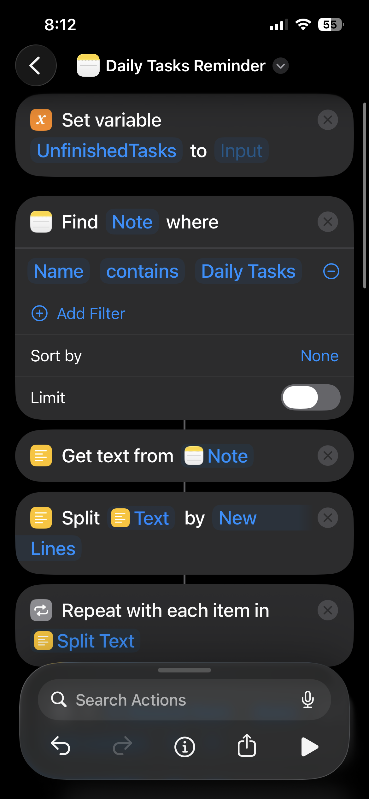
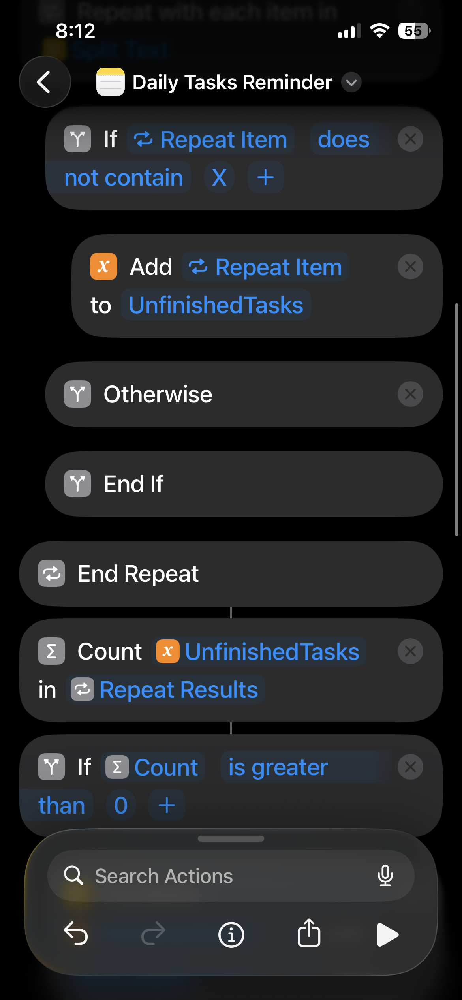
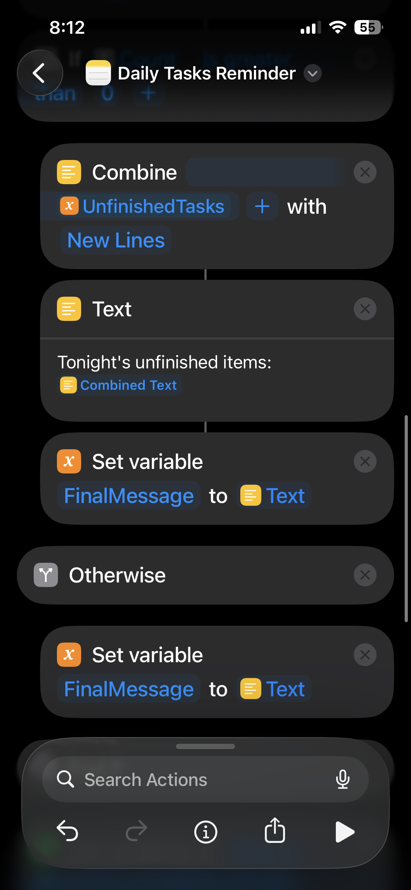
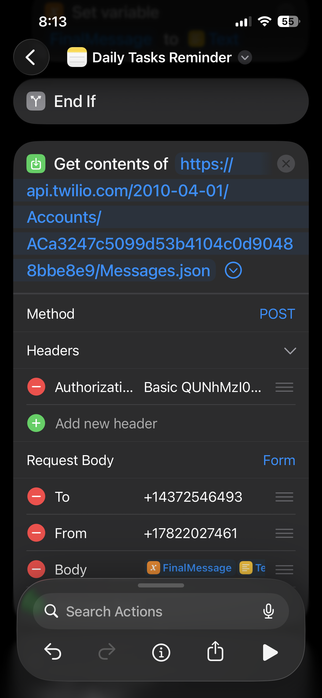

# Daily Tasks Reminder System

A nightly automation that sends unfinished to-do items from Apple Notes to your phone via SMS.

---

## Documentation

| Document | Description |
|----------|-------------|
| [REQUIREMENTS.md](./REQUIREMENTS.md) | Functional and non-functional requirements, user stories, acceptance criteria |
| [SPECIFICATIONS.md](./SPECIFICATIONS.md) | Technical architecture, data flow, API specs, error handling |
| [BUILD_PLAN.md](./BUILD_PLAN.md) | Phased implementation roadmap with tasks and test cases |

---

## Pain Points

1. **Forgotten tasks:** Items on the daily to-do list get overlooked and slip through the cracks
2. **Weekend spillover:** Incomplete tasks accumulate over several days and get pushed to weekends
3. **Manual checking friction:** Constantly opening the Notes app to review progress is inconvenient
4. **Mental burden:** Carrying the cognitive load of remembering what's done vs. undone

---

## Why This System

- **Peace of mind:** Go to sleep knowing the day's tasks are accounted for
- **Consistency:** Build reliable work habits through a structured daily routine
- **Passive visibility:** Tasks are delivered to you — no need to remember to check
- **Accountability:** A nightly nudge ensures nothing is forgotten

---

## Outcomes

- No more forgotten tasks slipping through unnoticed
- Reduced mental load — the system remembers so you don't have to
- Clearer separation between "work time" and "rest time"
- A repeatable, sustainable daily productivity routine

---

## Daily Workflow

| Time | Activity |
|------|----------|
| Morning | Review and plan tasks for the day in Apple Notes |
| Throughout day | Complete tasks and check them off as done |
| 10:00 PM | Receive automated SMS with remaining incomplete items |
| Before bed | Move any unfinished tasks to the next day |

---

## Overview

| Component | Details |
|-----------|---------|
| Source | Apple Notes → "Daily Tasks" note |
| Format | Bulleted checklist with checkboxes |
| Trigger | 10:00 PM daily |
| Delivery | SMS via Twilio |
| Platform | iOS Shortcuts (runs in background) |

---

## Gallery

| Image | Description |
|:---:|:---|
|  | **Shortcut Setup:** <br>The iOS Shortcut configuration showing the flow of actions. |
|  | **Notes Integration:** <br>Finding the specific "Daily Tasks" note within the Notes app. |
|  | **Logic Flow:** <br>Iterating through list items and checking for completion status. |
|  | **Final Result:** <br>The SMS notification received via Twilio containing the list of unfinished tasks. |

## Requirements

- iPhone running iOS 26.2+
- Twilio account with:
  - Account SID
  - Auth Token
  - Canadian (+1) phone number
- Apple Notes with a note titled "Daily Tasks"

---

## Behavior

### Message Content
- **Unchecked items exist:** List of incomplete tasks
- **All items checked:** "All tasks completed."

### Message Format
```
📋 Tonight's unfinished items:
• Task 1
• Task 2
• Task 3
```

### Background Execution
The Shortcut runs silently at 10pm without interrupting current activity.

---

## Twilio Configuration

| Setting | Value |
|---------|-------|
| Account SID | `[YOUR_TWILIO_SID]` |
| Auth Token | `[STORED SECURELY - DO NOT COMMIT]` |
| Twilio Phone Number | `[YOUR_TWILIO_NUMBER]` |
| Recipient Phone Number | `[YOUR_PHONE_NUMBER]` |
| Country Code | +1 (Canada) |

> **Security Note:** Auth Token should only be entered directly into the iOS Shortcut. Never store it in files or share it.

---

## Implementation Status

- [x] Project requirements defined
- [x] Twilio account created
- [x] Twilio credentials received
- [x] Requirements document created
- [x] Specifications document created
- [x] Build plan created
- [x] Phase 1: Foundation (Twilio SMS test)
- [x] Phase 2: Notes Integration
- [x] Phase 3: Message Formatting
- [x] Phase 4: Automation Setup
- [x] Phase 5: Polish & Documentation

**Status:** ✅ Project Complete / MVP Live

---

## Future Enhancements

### Additional Notifications

| Enhancement | Description |
|-------------|-------------|
| Morning briefing | SMS at 7am with the day's tasks to start your morning |
| Midday check-in | Optional early afternoon reminder to review progress |
| Customizable timing | Change notification times to fit your schedule |

### Multiple Lists

| List | Description |
|------|-------------|
| Work Tasks | Separate note for work-related to-do items |
| Personal Tasks | Separate note for personal errands and responsibilities |
| Others | Additional lists for miscellaneous categories |

### Calendar Integration

| Enhancement | Description |
|-------------|-------------|
| Next-day preview | The 10pm message includes calendar events for the following day |
