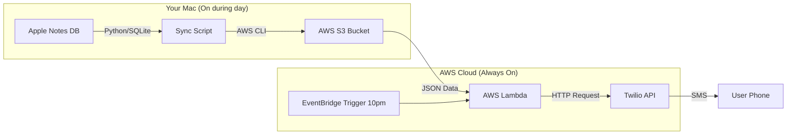

# Version B: Mac Sync + Cloud Delivery

This version solves the "Mac must be on" limitation by syncing data to the cloud during the day and using a serverless function to send the notification at night.

## Architecture



## Gallery

### Core Pipeline
| 1. Local Parsing | 2. Cloud Storage |
|:---:|:---:|
|  |  |
| **Terminal Output:**<br>The local Python script (`sync_tasks.py`) successfully connecting to the Apple Notes SQLite database, parsing 10 tasks, and uploading to S3. | **AWS S3 Console:**<br>Verification that the `tasks.json` file has been successfully uploaded to the S3 bucket `daily-tasks-reminder-data...`. |

| 3. Serverless Logic | 4. Final Delivery |
|:---:|:---:|
|  |  |
| **AWS Lambda Console:**<br>The `daily_task_notifier` function which reads the S3 file and integrates with Twilio. | **SMS Notification:**<br>The final result received on the iPhone. The message lists only the 10 unfinished tasks (filtering out checked items). |

### Development & Debugging
| Parsing Challenge |
|:---:|
|  |
| **Early Parsing Error:**<br>An earlier iteration where the parser incorrectly split task strings (e.g., "R", "ead", "10") because it treated every style run as a separate line. This was fixed by aggregating runs by line. |

## Features
- **Native Checklists:** Supports standard Apple Notes checklists (via SQLite parsing).
- **Background Sync:** Runs hourly via `launchd` in the background.
- **Reliable Delivery:** SMS sent from AWS Cloud, so your Mac doesn't need to be awake at 10 PM.

## Project Structure

- `src/`
    - `sync_tasks.py`: Main logic to read Notes DB and upload to S3.
    - `check_notes.py`: Debug script to inspect Notes DB.
    - `lambda/lambda_function.py`: Cloud function to send SMS.
- `infrastructure/`: Shell scripts for setup and provisioning (`setup_mac_agent.sh`, `provision_cloud.sh`, etc).
- `docs/`: Planning and requirement documents.

## Setup & Maintenance

### Checking Status (Mac)
The agent logs output to `/tmp`:
```bash
cat /tmp/com.aman.dailytasks.out
cat /tmp/com.aman.dailytasks.err
```

To stop the agent:
```bash
launchctl unload ~/Library/LaunchAgents/com.aman.dailytasks.plist
```

To restart the agent (e.g., after modifying code):
```bash
bash infrastructure/setup_mac_agent.sh
```

### Checking Status (Cloud)
- **S3 Bucket:** `daily-tasks-reminder-data-244316432377`
- **Lambda:** `daily_task_notifier`
- **Schedule:** `DailyTaskReminder-10PM` (Runs at 10:00 PM EST)

## Dependencies
- AWS CLI
- Python 3
- Twilio Account
