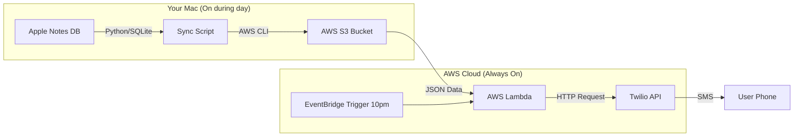
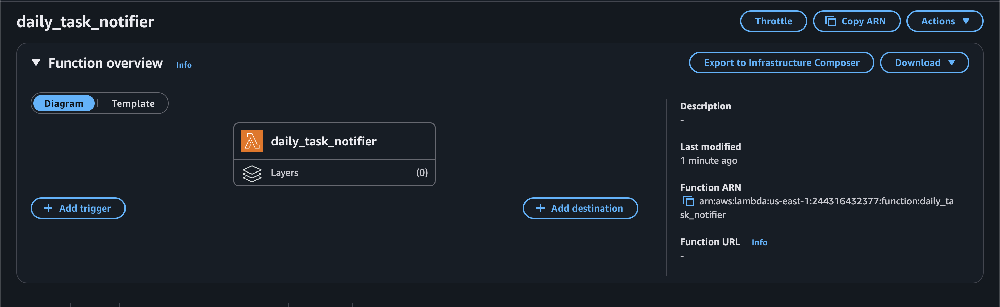
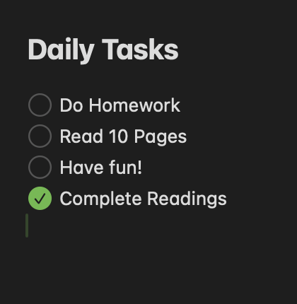
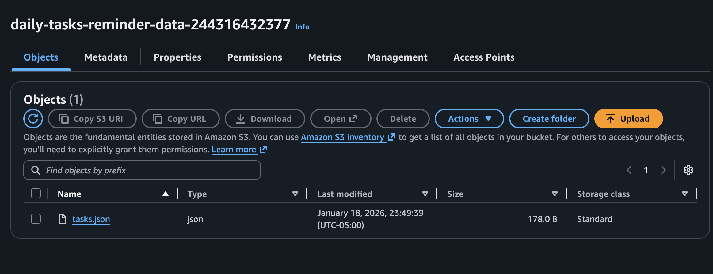
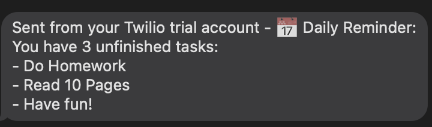
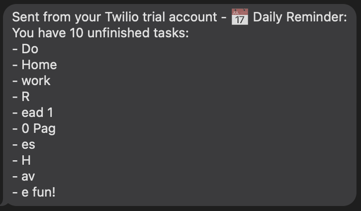

# Version B: Mac Sync + Cloud Delivery

This version solves the "Mac must be on" limitation by syncing data to the cloud during the day and using a serverless function to send the notification at night.

## Architecture



## Demo & Progress

| **1. Local Sync (Terminal)** | **2. Cloud Storage (AWS S3)** |
|:---:|:---:|
|  |  |
| *Python script syncing native checkboxes* | *JSON data synced to the cloud* |

| **3. Serverless Logic (Lambda)** | **4. Final Delivery (SMS)** |
|:---:|:---:|
|  |  |
| *Lambda function ready to trigger* | *The final result on your phone* |

### Debugging Journey
*Early Parsing Issues:*


## Features
- **Native Checklists:** Supports standard Apple Notes checklists (via SQLite parsing).
- **Background Sync:** Runs hourly via `launchd` in the background.
- **Reliable Delivery:** SMS sent from AWS Cloud, so your Mac doesn't need to be awake at 10 PM.

## Project Structure

- `src/`
    - `sync_tasks.py`: Main logic to read Notes DB and upload to S3.
    - `check_notes.py`: Debug script to inspect Notes DB.
    - `lambda/lambda_function.py`: Cloud function to send SMS.
- `infrastructure/`: Shell scripts for setup and provisioning (`setup_mac_agent.sh`, `provision_cloud.sh`, etc).
- `docs/`: Planning and requirement documents.

## Setup & Maintenance

### Checking Status (Mac)
The agent logs output to `/tmp`:
```bash
cat /tmp/com.aman.dailytasks.out
cat /tmp/com.aman.dailytasks.err
```

To stop the agent:
```bash
launchctl unload ~/Library/LaunchAgents/com.aman.dailytasks.plist
```

To restart the agent (e.g., after modifying code):
```bash
bash infrastructure/setup_mac_agent.sh
```

### Checking Status (Cloud)
- **S3 Bucket:** `daily-tasks-reminder-data-244316432377`
- **Lambda:** `daily_task_notifier`
- **Schedule:** `DailyTaskReminder-10PM` (Runs at 10:00 PM EST)

## Dependencies
- AWS CLI
- Python 3
- Twilio Account
