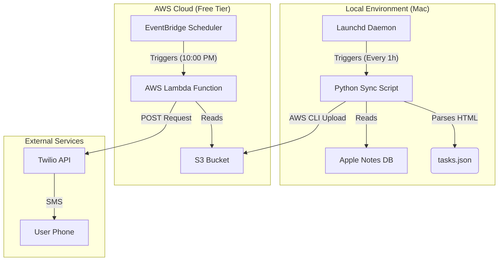

# Technical Specifications - Version B

## Document Info

| Field | Value |
|-------|-------|
| Project | Daily Tasks Reminder System |
| Module | Version B (Mac + AWS) |
| Version | 1.0 |

---

## System Architecture

This architecture decouples **Data Collection** from **Notification Delivery**.



---

## Data Structures

### 1. Intermediate Data (S3 Object)
**File:** `tasks.json`
**Path:** `s3://[bucket-name]/tasks.json`

```json
{
  "last_synced": "2026-01-18T14:30:00Z",
  "tasks": [
    {
      "text": "Buy groceries",
      "status": "unchecked"
    },
    {
      "text": "Email boss",
      "status": "checked"
    }
  ]
}
```

---

## Component Specifications

### 1. Mac Sync Agent (`sync_tasks.py`)
- **Language:** Python 3 + AppleScript (osascript)
- **Input:** "Daily Tasks" note body (HTML)
- **Logic:**
  1. Fetch note via AppleScript.
  2. Parse HTML list items (`<li>`).
  3. Detect `data-checked` attribute or checkbox input state.
  4. Generate JSON payload.
  5. Execute `aws s3 cp ...` to upload.

### 2. AWS S3 Bucket
- **Class:** Standard (Free Tier eligible)
- **Encryption:** SSE-S3 (Server-Side Encryption)
- **Public Access:** BLOCKED (Private only)
- **Lifecycle:** None required (files overwritten daily)

### 3. AWS Lambda Function (`notify_user`)
- **Runtime:** Python 3.9+
- **Trigger:** EventBridge Rule (Cron expression: `0 2 * * ? *` for 10pm EST)
- **Environment Variables:**
  - `TWILIO_SID`: [Secure String]
  - `TWILIO_TOKEN`: [Secure String]
  - `TWILIO_FROM`: +1...
  - `USER_PHONE`: +1...
  - `S3_BUCKET`: [Bucket Name]
  - `S3_KEY`: tasks.json

---

## API & Network

### Twilio Integration
Same as Version A, but initiated from Python (boto3/requests) instead of iOS Shortcuts.

- **Endpoint:** `https://api.twilio.com/2010-04-01/Accounts/{SID}/Messages.json`
- **Auth:** Basic Auth (SID + Token)

---

## Security Considerations

1.  **IAM Roles:**
    *   **Mac User:** `s3:PutObject` permission ONLY.
    *   **Lambda Role:** `s3:GetObject` and `logs:CreateLogGroup` permissions ONLY.
2.  **Credential Storage:**
    *   Mac: AWS Credentials stored in `~/.aws/credentials`.
    *   Lambda: Secrets stored in Environment Variables (encrypted at rest).
