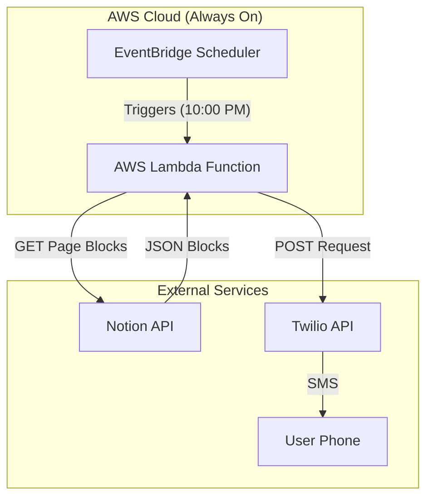

# Technical Specifications - Version C

## Document Info

| Field | Value |
|-------|-------|
| Project | Daily Tasks Reminder System |
| Module | Version C (Notion + Cloud) |
| Version | 1.0 |
| Status | Draft |

---

## System Architecture

This version is **Fully Serverless**. It removes the need for a local Mac synchronization agent by leveraging the Notion API directly from the cloud.



---

## Component Specifications

### 1. AWS Lambda Function (`notion_daily_notifier`)
- **Runtime:** Python 3.9+
- **Trigger:** EventBridge Rule (Cron: `0 2 * * ? *` for 10pm EST)
- **Dependencies:** Standard Library only (`urllib`, `json`, `os`) to avoid deployment complexity.
- **Logic:**
  1. Authenticate with Notion API using `NOTION_TOKEN`.
  2. Fetch block children from `NOTION_PAGE_ID`.
  3. Filter blocks where `type == "to_do"`.
  4. Check `checked` property.
  5. If unchecked tasks exist, format message.
  6. Send SMS via Twilio.

### 2. Environment Variables
The Lambda function requires the following secure environment variables:

| Variable | Description |
|----------|-------------|
| `NOTION_TOKEN` | Internal Integration Token (Secret) |
| `NOTION_PAGE_ID` | The ID of the Dashboard Page |
| `TWILIO_SID` | Twilio Account SID |
| `TWILIO_TOKEN` | Twilio Auth Token |
| `TWILIO_FROM` | Sending Phone Number |
| `TO_PHONE` | Destination Phone Number |

---

## API References

### Notion API
- **Endpoint:** `GET https://api.notion.com/v1/blocks/{block_id}/children`
- **Headers:**
  - `Authorization`: `Bearer {token}`
  - `Notion-Version`: `2022-06-28`
- **Response Structure:**
  ```json
  {
    "results": [
      {
        "type": "to_do",
        "to_do": {
          "rich_text": [{"text": {"content": "Task Name"}}],
          "checked": false
        }
      }
    ]
  }
  ```

### Twilio API
- **Endpoint:** `https://api.twilio.com/2010-04-01/Accounts/{SID}/Messages.json`
- **Method:** POST `Body`, `From`, `To`

---

## Security
- **Least Privilege:** Lambda needs no IAM permissions for S3 or DynamoDB, only `logs:CreateLogGroup` and basic execution.
- **Secrets Management:** All API keys are stored as encrypted Environment Variables in AWS Lambda.
